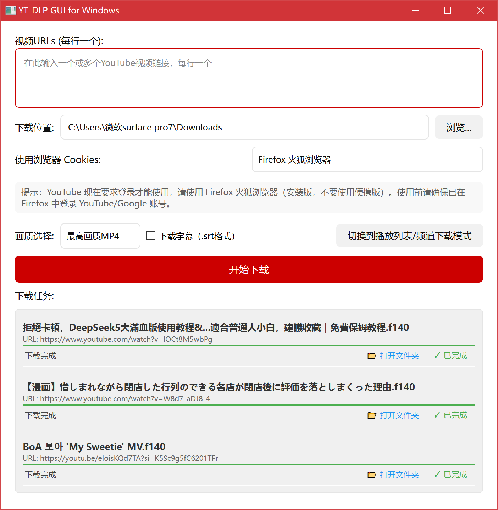
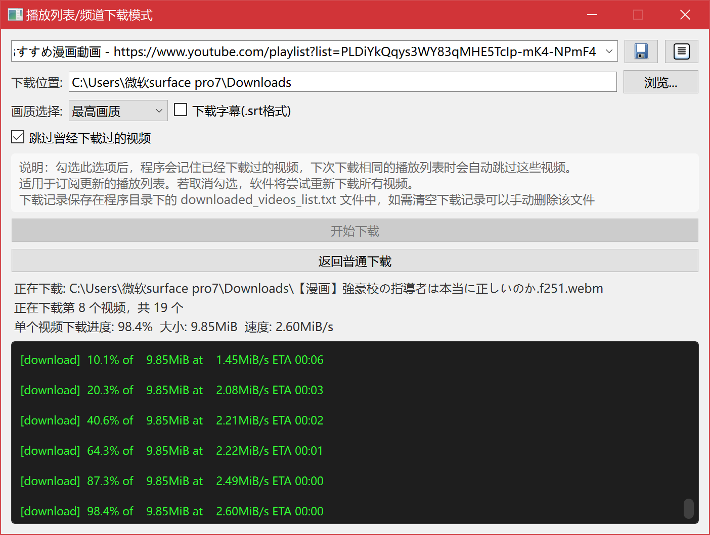

# YT-DLP GUI for Windows




一个简单易用的 YouTube 视频下载工具，基于著名开源工具 yt-dlp 开发的 Windows 图形界面程序。

## 主要功能

- 支持下载单个或多个 YouTube 视频
- 支持下载 YouTube 播放列表和频道
- 自动下载最高画质（比如8K），可选4K、1080P、480P画质
- 支持下载 MP3 格式的纯音频
- 支持下载字幕（.srt格式）
- 自动使用火狐浏览器 cookies 实现登录下载
- 支持订阅播放列表
- 可以跳过已下载视频（播放列表/频道下载模式），只下载新增内容

## 系统要求

- Windows 10/11
- Firefox 浏览器（必需）
- 网络连接

## 下载和安装

1. 从 [Releases](https://github.com/luluyayawawa123/yt-dlp-gui-windows/releases) 页面下载最新版本
2. 解压到任意位置
3. 运行 YT-DLP-GUI-Windows.exe

## 使用方法

1. **单个视频下载**
   - 复制 YouTube 视频链接
   - 粘贴到软件的 URL 输入框（支持多个链接，每行一个）
   - 选择下载位置
   - 选择画质（默认最高画质）或选择 MP3 格式下载纯音频
   - 点击"开始下载"

2. **播放列表/频道下载**
   - 点击"切换到播放列表/频道下载模式"
   - 输入播放列表或频道 URL
   - 选择下载选项
   - 点击"开始下载"


典型使用场景示例：
1. **订阅你喜欢的 YouTube 频道**
   ```
   https://www.youtube.com/@YourFavoriteChannel/videos
   ```
   下载频道中的所有视频。

2. **订阅你自己创建的播放列表**
   ```
   https://www.youtube.com/playlist?list=YOUR_PLAYLIST_ID
   ```
   在 YouTube APP 或网页版中创建自己的播放列表，将想要下载的视频添加到该播放列表中，
   然后复制该播放列表的链接，粘贴到软件的播放列表模式中，保存到收藏夹。下载的时候，勾选"跳过曾经下载过的视频"选项，只下载新增的视频内容。

## 注意事项

- 目前 YouTube 不支持游客观看视频，所以请先在 Firefox 中登录 YouTube/Google 账号
- 需要使用 Firefox 浏览器（安装版，不支持便携版）
- 下载位置请选择有足够空间的磁盘

## ⚠️ 重要提示

**如果遇到YouTube视频下载失败，请第一时间运行更新内核！**

📍 **更新内核文件位置**: `软件目录/bin/更新内核.bat`

- YouTube经常更新反爬虫机制，旧版本yt-dlp会失效
- 双击运行 `bin/更新内核.bat` 可将yt-dlp更新到最新版本
- 这能解决大部分下载失败问题，建议遇到问题时优先尝试
- 推荐定期更新内核保持最佳兼容性

## 常见问题

Q: 为什么一定要用 Firefox？  
A: Firefox 对 YouTube 视频下载支持最好，能够正确处理需要登录的视频。

Q: 下载失败怎么办？  
A: **⚠️ 重要：如果遇到YouTube视频下载失败的错误提示，请第一时间双击运行 `软件目录/bin/更新内核.bat` 更新yt-dlp内核到最新版本！**

请按以下步骤检查：
1. **首先运行 `软件目录/bin/更新内核.bat` 更新内核**（这能解决大部分下载问题）
2. 检查网络连接是否正常
3. 确保Firefox已登录YouTube账号
4. 确认视频可以在浏览器中正常播放
5. 检查下载路径是否有写入权限
6. 重启程序再次尝试

**⭐ 特别说明：**  
- YouTube经常更新其反爬虫机制，导致旧版本的yt-dlp无法正常工作
- `bin/更新内核.bat` 会将yt-dlp更新到最新版本，通常能解决大部分下载失败问题  
- 建议定期运行此脚本保持内核为最新版本 