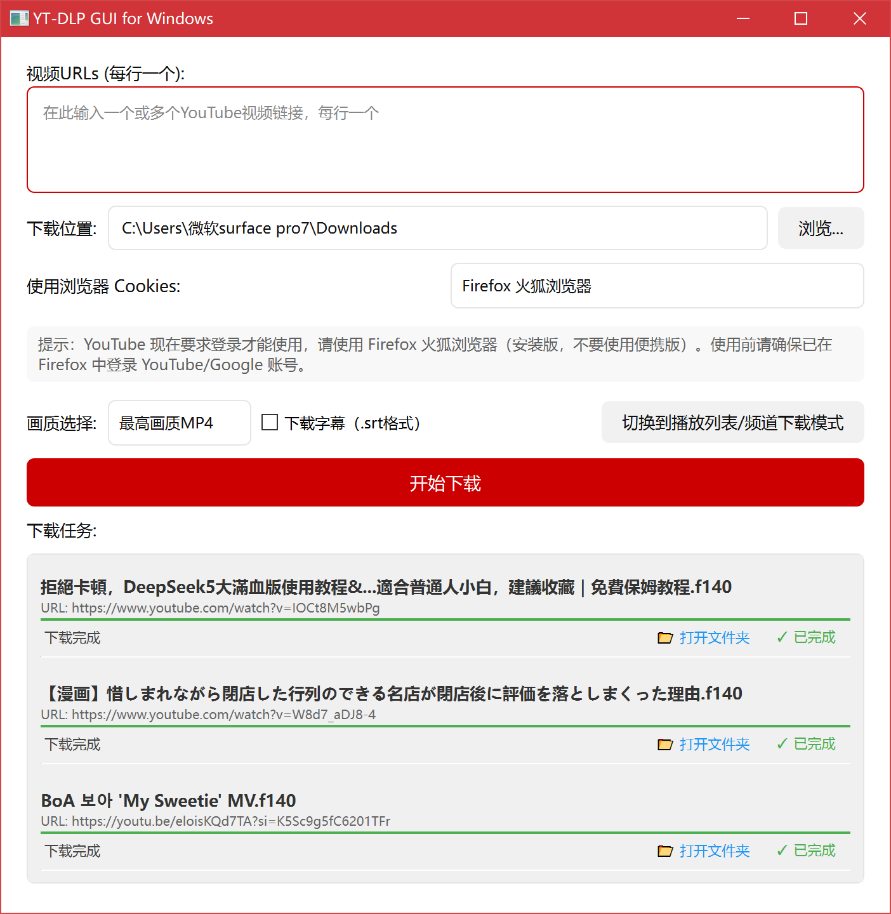
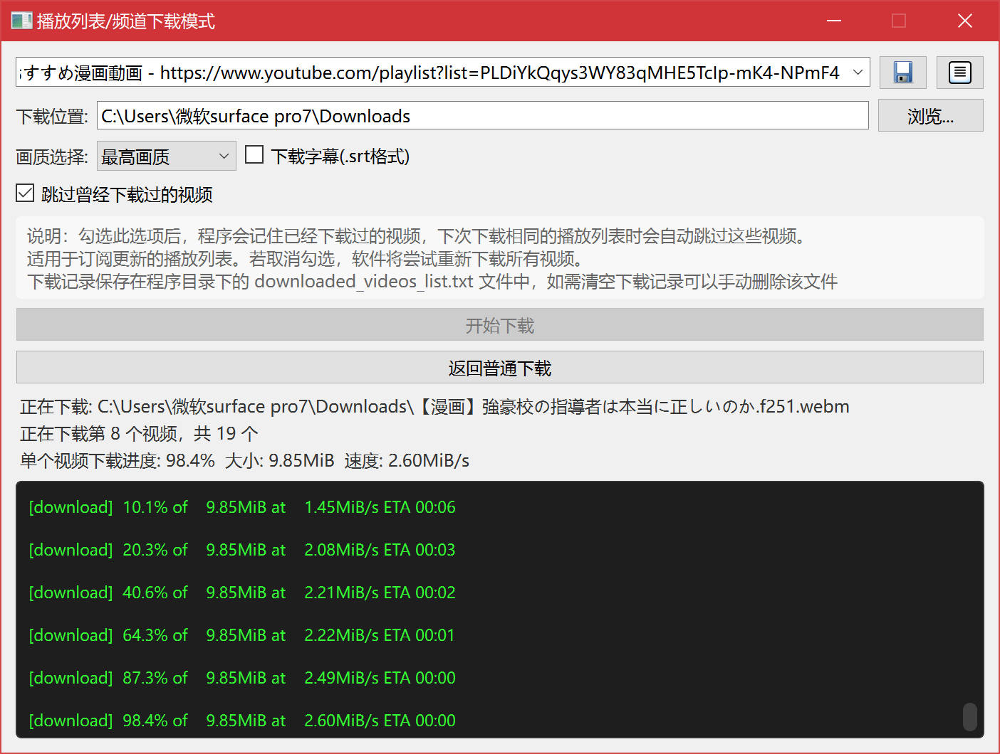

# YT-DLP GUI for Windows

这是一个基于 yt-dlp 的 Windows 视频下载软件，支持单个或多个视频、YouTube 播放列表与频道下载，也支持选择画质、提取 MP3 和下载字幕。

## 下载与使用

1. 从 [Releases](https://github.com/luluyayawawa123/yt-dlp-gui-windows/releases) 下载绿色版，解压后运行 `YT-DLP-GUI-Windows.exe`。绿色版文件夹可以移动或改名，但请保留其中的 `bin` 目录。
2. 普通下载：先在 Firefox 中登录 YouTube，再把视频链接粘贴到主窗口。多个链接每行填一个；选好保存位置、画质和字幕后，点击“开始下载”。
3. 播放列表/频道下载：切换到对应窗口，输入播放列表或频道链接。可勾选“跳过曾经下载过的视频”，下次只下载新增内容。

普通下载可选择最高画质、MP4 画质、MP3，或临时兜底的“斗地主模式”。实际能下载的清晰度取决于视频、网络和 YouTube 返回的格式，并非每个视频都有 4K。

## 当前 YouTube 下载方式

| 模式 | 客户端 | Firefox Cookies | 说明 |
| --- | --- | --- | --- |
| 普通下载 | mweb | 使用 | 通过内置 bgutil 组件获取 PO Token，可下载分离的视频和音频。 |
| 播放列表/频道 | mweb | 不使用 | 同样获取 PO Token，但匿名请求可能被 YouTube 要求登录。 |
| 斗地主模式（普通下载中的临时兜底） | web_safari | 使用 | 不获取 PO Token，尝试下载最高 1080P 的 HLS 流；部分视频可能没有可用流。 |

普通下载已完成开发版 4K 和绿色版的实际下载测试。播放列表暂未改成传入 Cookies 的方案，只是因为还没来得及测试，并不表示匿名下载更好。此前，不传 Cookies 的 mweb 在 GCP 出口 IP 下可以下载，在 Linode 美国出口 IP 下稳定失败；另一次测试还在生成 PO Token 前就收到 `LOGIN_REQUIRED`，要求登录确认不是机器人。Firefox 即使已经登录，播放列表也不会自动读取它的 Cookies。后续计划见 [软件待办事项](软件待办事项.txt)。

普通下载勾选“下载字幕”后，会尝试下载作者字幕并转换为 SRT；“斗地主模式”还会尝试下载自动生成的字幕。具体能下载哪些字幕，取决于视频和 YouTube 的返回结果。

## 运行环境与更新

- 支持 Windows 10/11。普通下载和“斗地主模式”需要 Firefox，且应先在浏览器中登录 YouTube；播放列表模式目前不读取浏览器 Cookies。
- 绿色版已包含 yt-dlp、FFmpeg、Deno 和 PO Token 组件，使用者不需要另行安装这些运行组件。
- `bin/更新Nightly内核.bat` 更新 yt-dlp Nightly；`bin/更新stable内核.bat` 更新稳定版。它们**只更新 yt-dlp 内核**，不会更新 bgutil 插件、脚本或 Deno。
- PO Token 组件的配套更新方法见 [维护说明](bin/bgutil-ytdlp-pot-provider%20维护说明.txt)。

## 下载失败时

- 提示 `LOGIN_REQUIRED` / `Sign in to confirm you’re not a bot`：YouTube 要求登录验证，并非 PO Token 生成失败。普通下载先检查 Firefox 是否仍处于登录状态；播放列表目前不读取 Cookies，可能需要更换出口 IP 后重试。
- 已取得格式或 Token，却在下载媒体时收到 `HTTP 403`：先试软件的“下载重试”；若仍失败，请查看完整日志。更新 yt-dlp 或 PO Token 组件也不能保证消除所有 403。
- 提示 DNS 解析失败：检查网络、VPN、代理和 DNS 设置。这与 Token 生成失败是两回事。
- 需要临时获取视频时，可试普通下载中的“斗地主模式”；若视频没有可用 HLS 流，该模式也可能失败。

问题背景和上游修复记录见 [PO Token 跟踪事项](YouTube上游PO%20Token修复跟踪事项.txt)。
